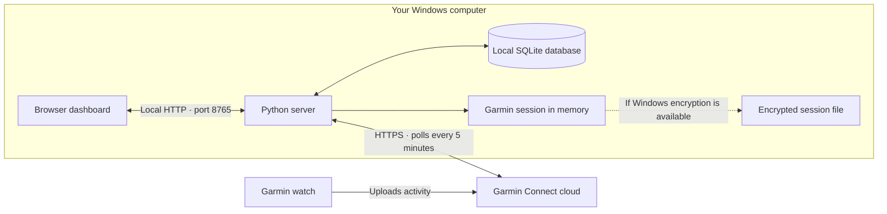

# PACE

A private running journal and half-marathon dashboard that runs on your Windows computer. Track runs, explore pace and mileage, plan training, and periodically import running activities from Garmin Connect.

This repository contains application source. Publishing it does not publish a running website, a database, or a Garmin account.

## Start locally

1. Install Python 3.11 or later on Windows, then clone or download this repository.
2. Open **Start PACE.cmd**. The first launch creates a local Python environment and installs the pinned dependencies from PyPI.
3. Visit **http://127.0.0.1:8765** and set your race, units, and goals.
4. Choose **Connections → Connect Garmin**. Enter your credentials and any verification code inside the local application.

PACE runs in the background until you open **Stop PACE.cmd** or shut down your computer. It is not installed as a startup service. Closing the browser does not stop syncing. No Node.js installation is needed to run the app.

An empty journal can display clearly labeled sample runs. These are generated in the browser; they are not saved in the database or included in exports.

## Features

- Overview with weekly mileage, weighted pace, running time, and race countdown.
- Searchable run journal with personal notes, effort, run types, and shoes.
- Progress charts and a training planner.
- Editable race goals and pace calculations.
- Garmin syncing, manual entries, CSV/TCX/GPX imports, and JSON export/import.

## Architecture and data location



| Location, relative to this folder | Contents | Included in Git? |
| --- | --- | --- |
| `.data/pace.sqlite3` | Imported runs, notes, plans, and settings | No |
| `.data/garmin-session.dpapi` | Windows-encrypted Garmin session, when supported | No |
| `.data/*.log` | Local startup/server logs | No |
| `.venv/` | Installed Python dependencies | No |

The server uses `.data` beside `server.py` unless `PACE_DATA_DIR` overrides it. SQLite is a file on your computer, not a hosted database. Garmin retains the original activities in Garmin Connect. PACE adds no cloud database, analytics, or remote font service; external requests support Garmin syncing and dependency installation. Opening an optional race website follows the link you configure.

The journal database is **not encrypted by PACE**. Protect your Windows account, disk, and backups. A program running under the same Windows account may access local data. See [SECURITY.md](SECURITY.md).

## How Garmin syncing works

Your watch must upload its activity to Garmin Connect first. PACE imports your running history after sign-in and checks for updates every five minutes while your computer is awake and the server is running. This is periodic syncing, not an instant watch push. Rate limits cause a 30-minute pause; other temporary errors retry after five minutes. Connections shows the last successful sync and any failure.

PACE uses the unofficial community `garminconnect` connector, pinned to version 0.3.5. Garmin can change or block this interface. Its [official developer program](https://developer.garmin.com/gc-developer-program/program-faq/) has separate approval requirements.

The password is not written to disk. On Windows, PACE attempts to encrypt the reusable session with DPAPI for the current Windows account. If secure storage is unavailable, the session stays in memory and you must sign in after restarting PACE. There is no plaintext session-file fallback. Disconnecting removes the saved session while keeping the journal.

## Backups

Use the app's JSON export for portable journal data. For a complete database backup, stop PACE, then copy `.data/pace.sqlite3` somewhere private. Exports contain personal activity data and settings; Garmin session tokens are not exported. Do not commit backups or exports to a public repository.

## Development and checks

The server uses Python's HTTP server and SQLite; the frontend uses native JavaScript modules and CSS. There is no frontend build step.

```powershell
.venv\Scripts\python.exe -m unittest discover -s tests -v
node --test tests/metrics.test.mjs
```

Node.js is needed only for the JavaScript tests. Tests use synthetic activities and temporary databases. A Windows DPAPI round-trip test may skip where the host cannot provide encryption; the memory-only failure path is also tested. Automated tests simulate Garmin integration: a real account sign-in is needed to verify current Garmin behavior.

`requirements-lock.txt` pins the full runtime dependency set. Review dependency updates and audit the lock file before publishing a release. Review the exact files staged for Git and scan for secrets; ignore patterns and scanners are safeguards, not guarantees.

Keep the server on loopback. LAN, tunnel, or cloud hosting would require a separate authentication and security design.
